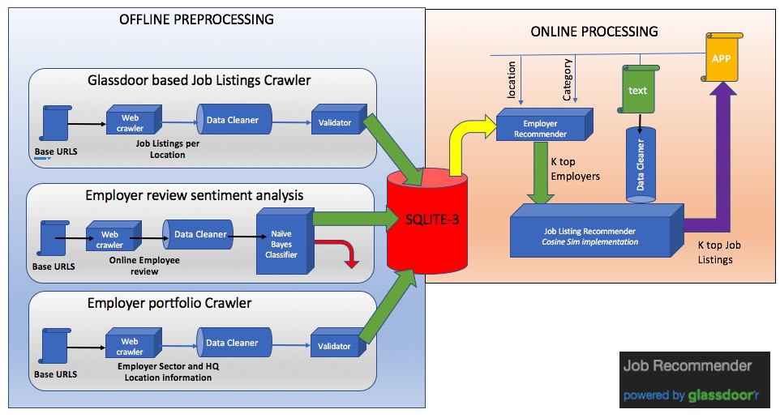

# Problem Statement:
   A content based recommendation system which recommends job applications based on professional experience, location and category.

## How it works?
   ### Architecture
   

   This software contains two major components.
   * Offline Preprocessor
   * Online Processor
   
   ### Offline Preprocessor ###
   All preprocessing and data gathering for content based filtering are done offline and stored in DB for a quicker response while recommending. This software is powered by GLASSDOOR and all contents are obtained from www.glassdoor.com
   Preprocessor consists of following components
   * Job Listing Crawler
      * Given a seed of URLS per location and sector, it crawls to actual Job Listings and gathers more detailed information about the advertisement.
   * Employer Sentiment Analyzer
      * Given location and sector, crawls to gather anonymous user reviews and performs sentiment analysis on them and drops employers below a threshold. 
   * Employer portfolio Crawler
      * Given location and sector, crawls to gather information about various employers and industry information
      
  ### Online Processor ###
  Software presents user with a web interface for entering location, category and professional experience summary and responses with top 10 job listing that matches or best fits user.
  
## How to run?
   * create a python virtual environment [ preferred ]
   * clone this git repository and navigate to top folder.
   * pip install -r requirements.txt
   * python main.py , would launch the backend webserver
   * open http://localhost:5000/index using any web browser
